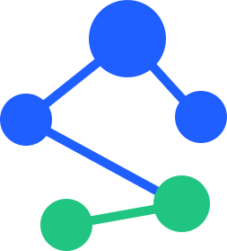

<p align="center">
  
</p>

<p align="center">
  <a href="https://www.npmjs.com/package/subjecto"></a>
  <a href="https://www.npmjs.com/package/subjecto"></a>
  <a href="#"></a>
  <a href="https://bundlephobia.com/package/subjecto"></a>
  <a href="#"></a>
</p>

# Subjecto

A minimalistic, zero-dependency JavaScript state management library built with TypeScript. Subjecto provides a simple and powerful API for managing application state with full type safety and modern JavaScript features.

## Table of Contents

- [Installation](#installation)
- [Quick Start](#quick-start)
- [Features](#features)
- [Debug UI](#debug-ui)
- [API Reference](#api-reference)
  - [Subject](#subject)
  - [DeepSubject](#deepsubject)
  - [batch](#batch)
- [Usage Examples](#usage-examples)
  - [Example 8: Using Built-in React Hooks](#example-8-using-built-in-react-hooks)
- [Advanced Topics](#advanced-topics)
  - [Path Patterns in DeepSubject](#path-patterns-in-deepsubject)
  - [Performance Comparison](#performance-comparison)
  - [Error Handling](#error-handling)
  - [Memory Management](#memory-management)
  - [Circular References](#circular-references)
- [TypeScript Support](#typescript-support)
  - [Type Exports](#type-exports)
  - [Advanced Type Utilities](#advanced-type-utilities-react-integration)
- [Best Practices](#best-practices)
- [Performance Considerations](#performance-considerations)
- [Migration Guide](#migration-guide)
- [React Integration](#react-integration)
  - [Built-in React Hooks](#built-in-react-hooks)
  - [useSubject](#usesubjectt)
  - [useDeepSubject](#usedeepsubjectt-p) — returns `[value, setter]`
  - [useDeepSubjectSelector](#usedeepsubjectselectort-p-r) — derived values with custom equality
  - [Understanding useSyncExternalStore](#understanding-usesyncexternalstore-advanced)
  - [Performance Tips for React](#performance-tips-for-react)
  - [Server-Side Rendering (SSR)](#server-side-rendering-ssr)
- [Troubleshooting](#troubleshooting)
  - [Common Issues](#common-issues)
  - [FAQ](#faq)
- [Contributing](#contributing)
- [License](#license)

## Installation

```bash
npm install subjecto
```

```bash
yarn add subjecto
```

```bash
pnpm add subjecto
```

## Bundle Size

Subjecto is extremely lightweight and tree-shakeable:

| Import | Minified | Gzipped | Use Case |
|--------|----------|---------|----------|
| `subjecto/core` | 1.4KB | **0.6KB** | Minimal - Subject only |
| `subjecto/helpers` | 0.7KB | **0.3KB** | Tree-shakeable utilities |
| `subjecto` (full) | 4.8KB | **1.8KB** | Subject + DeepSubject |
| `subjecto/react` | 1.2KB | **0.5KB** | React hooks |
| `subjecto/debug` | 20KB | **7KB** | Visual debugging UI with graph |

**Comparison with other libraries:**
- Zustand: ~1.2KB gzipped
- Subjecto Core: **0.6KB gzipped** (50% smaller!)
- Subjecto Full: **1.8KB gzipped** (with nested reactivity)

### Modular Imports

Import only what you need to minimize bundle size:

```typescript
// Minimal - just Subject (~0.6KB gzipped)
import { Subject } from 'subjecto/core'

// Full - Subject + DeepSubject + batch + helpers (~1.8KB gzipped)
import { Subject, DeepSubject, batch, toggle, nextPush } from 'subjecto'

// Tree-shakeable helpers only (~0.3KB gzipped per helper)
import { nextPush, toggle, once } from 'subjecto/helpers'

// React hooks (~0.5KB gzipped)
import { useSubject, useDeepSubject, useDeepSubjectSelector } from 'subjecto/react'

// Debug UI (~5KB gzipped, dev-only)
import { debugSubject } from 'subjecto/debug'
```

## Quick Start

### Basic Subject Usage

```typescript
import { Subject } from "subjecto";

// Create a subject with an initial value
const count = new Subject<number>(0);

// Subscribe to changes
const subscription = count.subscribe((value) => {
  console.log("Count changed:", value);
});

// Update the value
count.next(1); // Logs: "Count changed: 1"
count.next(2); // Logs: "Count changed: 2"

// Get current value
console.log(count.getValue()); // 2

// Unsubscribe
subscription.unsubscribe();
```

### DeepSubject Usage

```typescript
import { DeepSubject } from "subjecto";

// Create a deep subject with nested data
const state = new DeepSubject({
  user: {
    name: "John",
    age: 30,
    preferences: {
      theme: "dark",
    },
  },
});

// Subscribe to specific paths
state.subscribe("user/name", (name) => {
  console.log("Name changed:", name);
});

// Mutate values directly
state.getValue().user.name = "Jane"; // Triggers subscription

// Unsubscribe
const handle = state.subscribe("user/name", callback);
handle.unsubscribe();
```

## Features

- **Tiny Bundle Size**: Core is only **0.6KB gzipped**, full bundle **1.8KB gzipped** - smaller than Zustand!
- **Zero Dependencies**: No external dependencies, keeping your bundle size minimal (peer dependency on React 18+ for optional React hooks)
- **Tree-shakeable**: Import only what you need with modular exports (`core`, `helpers`, `react`)
- **Type Safety**: Fully typed with TypeScript, no `any` types used
- **Two State Management Patterns**:
  - **Subject**: Simple value container with subscription pattern
  - **DeepSubject**: Deep reactive state with path-based subscriptions
- **Built-in React Hooks**: First-class React integration with type-safe hooks (`useSubject`, `useDeepSubject`, `useDeepSubjectSelector`)
- **Path-based Subscriptions**: Subscribe to nested properties using string paths with full TypeScript inference
- **Wildcard Support**: Use `*` and `**` patterns for flexible subscriptions
- **Automatic Change Detection**: DeepSubject automatically detects nested mutations
- **Error Resilient**: Subscriber errors don't break other subscriptions
- **Visual Debug UI**: Interactive debugging utility with real-time updates, history tracking, and value editing ([see Debug UI](#debug-ui))
- **Memory Efficient**: Uses WeakMap for proxy caching with optimized path matching
- **Circular Reference Safe**: Handles circular references gracefully
- **SSR Compatible**: Works seamlessly with server-side rendering (Next.js, Remix, etc.)
- **Production Optimized**: Debug code automatically stripped from production builds

## Debug UI

Subjecto includes a powerful visual debugging utility that provides real-time inspection of Subject instances with zero dependencies (pure vanilla JavaScript).

### Features

- 📊 **Real-time Updates** - Watch your Subject's state change live
- 📈 **Graph Visualization** - Interactive timeline graph with auto-refresh every second
- ⏱ **Time Windows** - View last 30s, 60s, or 3 minutes of data
- 📜 **History Tracking** - Keep up to 50 entries of value changes with timestamps
- 🔄 **Dual View Modes** - Toggle between list and graph views
- 👥 **Subscriber List** - See all active subscriptions
- ✏️ **Value Editor** - Manually update values via JSON input
- ⏸ **Pause/Resume** - Freeze updates for inspection
- 📋 **Copy to Clipboard** - Export current value as JSON
- 🎨 **Dark Mode Support** - Matches your theme preference
- 🗂 **Collapsible Sections** - Organize your debug view
- 0️⃣ **Zero Dependencies** - Pure vanilla JS, no frameworks required

### Basic Usage

```typescript
import { Subject } from 'subjecto'
import { debugSubject } from 'subjecto/debug'

const counter = new Subject(0, { name: 'counter' })

// Mount debug UI to a DOM element
const cleanup = debugSubject(
  counter,
  document.getElementById('debug-container')
)

// Update the subject normally
counter.next(1)
counter.next(2)

// Later: cleanup when done
cleanup()
```

### With Options

```typescript
debugSubject(subject, container, {
  maxHistory: 100,        // Keep up to 100 history entries (default: 50)
  darkMode: true,         // Enable dark mode (default: false)
  title: 'My Counter',    // Custom title (default: subject name)
  editable: true,         // Enable value editor (default: true)
  collapsible: true,      // Enable collapsible sections (default: true)
})
```

### Live Demo

Open `examples/debug-demo.html` in your browser to see the debug UI in action with multiple interactive examples.

**Learn more:** See the complete documentation in [`src/debug.README.md`](./src/debug.README.md)

## API Reference

### Subject

A simple, type-safe container for a value that notifies subscribers when the value changes.

#### Constructor

```typescript
new Subject<T>(initialValue: T, options?: SubjectConstructorOptions)
```

**Parameters:**

- `initialValue` (required): The initial value of the subject
- `options` (optional): Configuration object
  - `name?: string` - Custom name for debugging (default: `'noName'`)
  - `updateIfStrictlyEqual?: boolean` - When `true` (default), subscribers are notified even when the new value is strictly equal (`===`) to the old value. Set to `false` to skip notifications for equal values, which can improve performance when you know the value hasn't meaningfully changed

**Example:**

```typescript
const subject = new Subject<string>("hello", {
  name: "mySubject",
  updateIfStrictlyEqual: false,
});
```

#### Methods

##### `subscribe(subscription: SubjectSubscription<T>): SubscriptionHandle`

Subscribe to value changes. The subscription callback is immediately called with the current value.

**Parameters:**

- `subscription`: A function that receives the new value when it changes

**Returns:** A `SubscriptionHandle` object with:

- `unsubscribe(): void` - Unsubscribe from updates
- `id: symbol` - Unique identifier for this subscription

**Example:**

```typescript
const handle = subject.subscribe((value) => {
  console.log("New value:", value);
});

// Later...
handle.unsubscribe();
```

##### `next(nextValue: T): void`

Update the subject's value and notify all subscribers.

**Parameters:**

- `nextValue`: The new value

**Example:**

```typescript
subject.next("world");
```

##### `nextAssign(newValue: Partial<T>): void`

Update the subject's value by merging with the current value (object assign). Only works when the current value is an object.

**Throws:** `Error` if the current value is not an object

**Example:**

```typescript
const subject = new Subject({ a: 1, b: 2 });
subject.nextAssign({ b: 3 }); // { a: 1, b: 3 }
```

##### `nextPush(value: unknown): void`

Push a new item to the subject if it's an array.

**Throws:** `Error` if the current value is not an array

**Example:**

```typescript
const subject = new Subject([1, 2, 3]);
subject.nextPush(4); // [1, 2, 3, 4]
```

##### `toggle(): void`

Toggle a boolean value.

**Throws:** `Error` if the current value is not a boolean

**Example:**

```typescript
const subject = new Subject(false);
subject.toggle(); // true
subject.toggle(); // false
```

##### `once(subscription: SubjectSubscription<T>): void`

Subscribe to the next value change only. The subscription is automatically removed after being called once.

**Example:**

```typescript
subject.once((value) => {
  console.log("This will only be called once:", value);
});
```

##### `complete(): void`

Unsubscribe all subscribers at once.

**Example:**

```typescript
subject.complete();
```

##### `unsubscribe(id: symbol): boolean`

Unsubscribe a specific subscription by its ID.

**Parameters:**

- `id`: The subscription ID (from `SubscriptionHandle.id`)

**Returns:** `true` if the subscription was found and removed, `false` otherwise

##### `getValue(): T`

Get the current value of the subject.

**Returns:** The current value

#### Properties

##### `subscribers: Map<symbol, SubjectSubscription<T>>`

A Map of all active subscriptions. Useful for debugging and introspection.

##### `debug: boolean | ((nextValue: T) => void)`

Enable debug logging. Set to `true` for default logging, or provide a custom function.

**Example:**

```typescript
// Default debug logging
subject.debug = true;

// Custom debug function
subject.debug = (value) => {
  console.log("Custom debug:", value);
};
```

##### `before: (nextValue: T) => T`

A function that transforms the value before it's set and subscribers are notified. Useful for validation, normalization, or transformation.

**Example:**

```typescript
subject.before = (value) => {
  // Ensure value is always positive
  return Math.abs(value);
};

subject.next(-5); // Actually sets 5
```

##### `count: number`

The number of times `next()` has been called (including initialization). Starts at `1`.

##### `options: SubjectConstructorOptions`

The options passed to the constructor.

---

### Tree-shakeable Helpers

For minimal bundle size, you can import helper functions separately from `subjecto/helpers`. These are standalone utilities that work with Subject instances.

**Benefits:**
- **Smaller bundles**: Only include the helpers you actually use (~0.3KB gzipped)
- **Same functionality**: Identical to Subject methods, just imported separately
- **Tree-shakeable**: Unused helpers are automatically removed from your bundle

#### Available Helpers

All helpers are available both as `Subject` methods (for convenience) and as standalone imports (for tree-shaking):

##### `nextAssign<T>(subject: Subject<T>, newValue: Partial<T>)`

Merge partial values into the current state (for object values only).

```typescript
import { Subject } from 'subjecto/core'
import { nextAssign } from 'subjecto/helpers'

const subject = new Subject({ a: 1, b: 2 })
nextAssign(subject, { b: 3 }) // { a: 1, b: 3 }

// Or use the method directly (no tree-shaking):
subject.nextAssign({ b: 3 })
```

##### `nextPush<T>(subject: Subject<T[]>, value: T)`

Push a value to an array.

```typescript
import { nextPush } from 'subjecto/helpers'

const subject = new Subject([1, 2, 3])
nextPush(subject, 4) // [1, 2, 3, 4]
```

##### `toggle(subject: Subject<boolean>)`

Toggle a boolean value.

```typescript
import { toggle } from 'subjecto/helpers'

const subject = new Subject(false)
toggle(subject) // true
toggle(subject) // false
```

##### `once<T>(subject: Subject<T>, callback: (value: T) => void)`

Subscribe to the next value change only.

```typescript
import { once } from 'subjecto/helpers'

const subject = new Subject(0)
once(subject, (value) => {
  console.log('This will only be called once:', value)
})
```

##### `complete<T>(subject: Subject<T>)`

Unsubscribe all subscribers at once.

```typescript
import { complete } from 'subjecto/helpers'

const subject = new Subject(0)
complete(subject) // Removes all subscribers
```

**Note:** All helpers throw appropriate errors if the Subject value is not the expected type (e.g., `nextPush` requires an array).

---

### DeepSubject

A reactive state container that automatically tracks changes to nested objects and arrays, allowing you to subscribe to specific paths in your data structure.

#### Constructor

```typescript
new DeepSubject<T extends DeepValue>(initialValue: T, options?: DeepSubjectConstructorOptions)
```

**Parameters:**

- `initialValue` (required): The initial object value (must be an object)
- `options` (optional): Configuration object
  - `name?: string` - Custom name for debugging (default: `'noName'`)
  - `updateIfStrictlyEqual?: boolean` - Whether to notify subscribers when the new value is strictly equal (`===`) to the current value (default: `true`)

**Example:**

```typescript
const state = new DeepSubject(
  {
    user: { name: "John" },
  },
  {
    name: "appState",
    updateIfStrictlyEqual: false,
  }
);
```

#### Methods

##### `subscribe(pattern: Path, subscriber: DeepSubjectSubscription, options?: SubscribeOptions): DeepSubscriptionHandle`

Subscribe to changes at a specific path or pattern. By default, the subscriber is immediately called with the current value at that path.

**Parameters:**

- `pattern`: A path string (e.g., `"user/name"`) or pattern with wildcards (`"user/*"`, `"user/**"`)
- `subscriber`: A function that receives the value when it changes
- `options` (optional): Configuration object
  - `skipInitialCall?: boolean` - When `true`, the subscriber will not be called immediately with the current value. This is useful when integrating with React's `useSyncExternalStore` to avoid duplicate renders. Default: `false`

**Returns:** A `DeepSubscriptionHandle` object with:

- `unsubscribe(): void` - Unsubscribe from updates

**Path Examples:**

- `"user"` - Subscribe to the `user` property
- `"user/name"` - Subscribe to `user.name`
- `"user/profile/details"` - Subscribe to `user.profile.details`

**Wildcard Patterns:**

- `"user/*"` - Subscribe to any direct child of `user` (e.g., `user.name`, `user.age`)
- `"user/**"` - Subscribe to any descendant of `user` at any depth
- `"**"` - Subscribe to all changes in the entire object

**Important Notes:**

- Array index subscriptions (e.g., `"cart/items/0"`) are not supported. Subscribe to the array itself (`"cart/items"`) or use wildcard patterns (`"cart/**"`) instead
- Subscribing to a parent path (e.g., `"user"`) will automatically receive notifications when any descendant changes (e.g., `"user/name"`, `"user/profile/bio"`)
- Array mutation methods (`push`, `pop`, `shift`, `unshift`, `splice`, `sort`, `reverse`) produce a **new array reference**, making them fully compatible with React's `useMemo` deps, `useEffect` deps, and reference equality checks

**Example:**

```typescript
const state = new DeepSubject({
  user: {
    name: "John",
    profile: { age: 30 },
  },
});

// Exact path
state.subscribe("user/name", (name) => {
  console.log("Name:", name);
});

// Wildcard - any direct child
state.subscribe("user/*", (value) => {
  console.log("Any user property changed:", value);
});

// Deep wildcard - any descendant
state.subscribe("user/**", (value) => {
  console.log("User subtree changed:", value);
});

// Root wildcard - everything
state.subscribe("**", (value) => {
  console.log("Anything changed:", value);
});
```

##### `next(nextValue: T): void`

Replace the entire state object and notify all subscribers.

**Parameters:**

- `nextValue`: The new state object

**Example:**

```typescript
state.next({
  user: { name: "Jane", age: 25 },
});
```

##### `unsubscribe(subscriber: DeepSubjectSubscription): void`

Remove a subscriber function from all paths/patterns it's subscribed to.

**Parameters:**

- `subscriber`: The callback function to remove

**Example:**

```typescript
const callback = (value) => console.log(value);
state.subscribe("user/name", callback);
state.subscribe("user/age", callback);

// Remove from all subscriptions
state.unsubscribe(callback);
```

##### `complete(): void`

Unsubscribe all subscribers at once.

**Example:**

```typescript
state.complete(); // Removes all subscribers
```

##### `getValue(): T`

Get the current state object. The returned object is proxied, so mutations will trigger subscriptions.

**Returns:** The current state object (proxied)

**Example:**

```typescript
const stateObj = state.getValue();
stateObj.user.name = "Jane"; // Triggers subscriptions
```

#### Properties

##### `debug: boolean | ((nextValue: T) => void)`

Enable debug logging. Set to `true` for default logging, or provide a custom function.

##### `before: (nextValue: T) => T`

A function that transforms the value before it's set and subscribers are notified.

##### `count: number`

The number of times `next()` has been called (including initialization). Starts at `1`.

---

### `batch`

Batch multiple mutations into a single notification cycle. Subscribers are notified once per unique path after the batch completes.

**Signature:**
```typescript
function batch(fn: () => void): void
```

**Example:**

```typescript
import { DeepSubject, batch } from "subjecto";

const state = new DeepSubject({
  user: { name: "Alice", age: 30 },
});

// Without batch: two notification cycles
state.getValue().user.name = "Bob";
state.getValue().user.age = 31;

// With batch: one notification cycle
batch(() => {
  state.getValue().user.name = "Bob";
  state.getValue().user.age = 31;
});
```

Batches can be nested — notifications are flushed only when the outermost batch completes.

---

## Usage Examples

### Example 1: Form State Management

```typescript
import { Subject } from "subjecto";

interface FormData {
  email: string;
  password: string;
  rememberMe: boolean;
}

const form = new Subject<FormData>({
  email: "",
  password: "",
  rememberMe: false,
});

// Subscribe to form changes
form.subscribe((data) => {
  console.log("Form updated:", data);
});

// Update form fields
form.nextAssign({ email: "user@example.com" });
form.nextAssign({ password: "secret123" });
form.nextAssign({ rememberMe: true });

// Toggle remember me
form.getValue().rememberMe = false;
form.toggle(); // Only works if rememberMe is boolean
```

### Example 2: Shopping Cart

```typescript
import { Subject } from "subjecto";

interface CartItem {
  id: number;
  name: string;
  price: number;
  quantity: number;
}

const cart = new Subject<CartItem[]>([]);

// Add item
cart.subscribe((items) => {
  const total = items.reduce(
    (sum, item) => sum + item.price * item.quantity,
    0
  );
  console.log(`Cart total: $${total.toFixed(2)}`);
});

cart.nextPush({ id: 1, name: "Product A", price: 10, quantity: 2 });
cart.nextPush({ id: 2, name: "Product B", price: 15, quantity: 1 });
```

### Example 3: Application State with DeepSubject

```typescript
import { DeepSubject } from "subjecto";

interface AppState {
  user: {
    id: number;
    name: string;
    preferences: {
      theme: "light" | "dark";
      notifications: boolean;
    };
  };
  cart: {
    items: Array<{ id: number; quantity: number }>;
    total: number;
  };
}

const appState = new DeepSubject<AppState>({
  user: {
    id: 1,
    name: "John",
    preferences: {
      theme: "dark",
      notifications: true,
    },
  },
  cart: {
    items: [],
    total: 0,
  },
});

// Subscribe to user name changes
appState.subscribe("user/name", (name) => {
  console.log("User name changed to:", name);
});

// Subscribe to theme changes
appState.subscribe("user/preferences/theme", (theme) => {
  document.body.className = theme;
});

// Subscribe to any cart changes
appState.subscribe("cart/**", (cartData) => {
  console.log("Cart updated:", cartData);
});

// Mutate state
appState.getValue().user.name = "Jane";
appState.getValue().user.preferences.theme = "light";
appState.getValue().cart.items.push({ id: 1, quantity: 2 });
```

### Example 4: Real-time Data Updates

```typescript
import { Subject } from "subjecto";

interface Message {
  id: number;
  text: string;
  timestamp: Date;
}

const messages = new Subject<Message[]>([]);

// Subscribe to new messages
messages.subscribe((msgs) => {
  console.log(`You have ${msgs.length} messages`);
});

// Simulate receiving messages
setInterval(() => {
  messages.nextPush({
    id: Date.now(),
    text: `Message ${Date.now()}`,
    timestamp: new Date(),
  });
}, 1000);
```

### Example 5: Settings Management

```typescript
import { DeepSubject } from "subjecto";

const settings = new DeepSubject({
  appearance: {
    theme: "dark",
    fontSize: 14,
  },
  privacy: {
    shareAnalytics: false,
    shareLocation: true,
  },
});

// Subscribe to all appearance changes
settings.subscribe("appearance/**", (appearance) => {
  console.log("Appearance updated:", appearance);
  // Apply theme changes
  applyTheme(appearance.theme);
});

// Subscribe to specific privacy setting
settings.subscribe("privacy/shareAnalytics", (value) => {
  console.log("Analytics sharing:", value);
});

// Update settings
settings.getValue().appearance.theme = "light";
settings.getValue().privacy.shareAnalytics = true;
```

### Example 6: Validation with `before` Hook

```typescript
import { Subject } from "subjecto";

const age = new Subject<number>(0);

// Validate and normalize before setting
age.before = (value) => {
  if (value < 0) return 0;
  if (value > 120) return 120;
  return Math.floor(value); // Ensure integer
};

age.subscribe((value) => {
  console.log("Validated age:", value);
});

age.next(-5); // Sets to 0
age.next(150); // Sets to 120
age.next(25.7); // Sets to 25
```

### Example 7: One-time Subscriptions

```typescript
import { Subject } from "subjecto";

const dataLoaded = new Subject<boolean>(false);

// Wait for data to load once
dataLoaded.once((loaded) => {
  if (loaded) {
    console.log("Data loaded! Initializing app...");
    initializeApp();
  }
});

// Simulate async data loading
fetchData().then(() => {
  dataLoaded.next(true); // Triggers once subscription
  dataLoaded.next(true); // Does nothing (subscription already removed)
});
```

### Example 8: Using Built-in React Hooks

Subjecto provides first-class React integration with built-in, type-safe hooks:

```tsx
import { Subject, DeepSubject, batch } from "subjecto";
import { useSubject, useDeepSubject, useDeepSubjectSelector } from "subjecto/react";

// Create subjects outside components
const counterSubject = new Subject(0);
const appState = new DeepSubject({
  user: {
    name: "Alice",
    profile: { bio: "Software Engineer", location: "San Francisco" },
  },
  cart: {
    items: [] as Array<{ id: number; name: string; price: number }>,
  },
});

// Simple counter with useSubject
function Counter() {
  const [count, setCount] = useSubject(counterSubject);
  return (
    <div>
      <p>Count: {count}</p>
      <button onClick={() => setCount(count + 1)}>+</button>
      <button onClick={() => setCount(0)}>Reset</button>
    </div>
  );
}

// Subscribe to a specific path — returns [value, setter]
function UserName() {
  const [name, setName] = useDeepSubject(appState, "user/name");
  return (
    <div>
      <p>Name: {name}</p>
      <button onClick={() => setName("Bob")}>Change Name</button>
    </div>
  );
}

// Subscribe to a nested object
function UserProfile() {
  const [profile] = useDeepSubject(appState, "user/profile");
  return (
    <div>
      <p>{profile.bio} in {profile.location}</p>
    </div>
  );
}

// Derived values with useDeepSubjectSelector
function CartSummary() {
  const total = useDeepSubjectSelector(
    appState, "cart/items",
    (items) => items.reduce((sum, item) => sum + item.price, 0),
  );
  return <p>Total: ${total.toFixed(2)}</p>;
}

// Batch multiple mutations into one notification cycle
function Settings() {
  const [name] = useDeepSubject(appState, "user/name");
  return (
    <div>
      <p>{name}</p>
      <button onClick={() => {
        batch(() => {
          appState.getValue().user.name = "Charlie";
          appState.getValue().user.profile.bio = "CTO";
        });
      }}>
        Batch Update
      </button>
    </div>
  );
}
```

## Advanced Topics

### Path Patterns in DeepSubject

DeepSubject supports flexible path patterns for subscribing to multiple paths:

#### Single Wildcard (`*`)

Matches any single level in the path:

```typescript
// Matches: user/name, user/age, user/email
// Does NOT match: user/profile/name
state.subscribe("user/*", callback);
```

#### Double Wildcard (`**`)

Matches any depth:

```typescript
// Matches: user/name, user/profile/name, user/profile/details/age
state.subscribe("user/**", callback);
```

#### Root Wildcard (`**`)

Subscribe to all changes:

```typescript
// Matches everything
state.subscribe("**", callback);
```

#### Performance Comparison

Different subscription patterns have different performance characteristics:

| Pattern | Description | Performance | Use When |
|---------|-------------|-------------|----------|
| Exact path<br/>`"user/name"` | Single specific property | ⚡⚡⚡ Fastest | You need only one specific value |
| Single wildcard<br/>`"user/*"` | Direct children only | ⚡⚡ Fast | You need any direct child property |
| Deep wildcard<br/>`"user/**"` | Any descendant at any depth | ⚡ Moderate | You need any property within a subtree |
| Root wildcard<br/>`"**"` | Everything in the object | 🐢 Slower | Global state tracking, debugging |

**Best Practices:**
- Use the most specific path possible for best performance
- Avoid root wildcard (`**`) in production unless necessary
- Single wildcards (`*`) are a good balance between flexibility and performance
- Deep wildcards (`path/**`) are ideal for React hooks that need to detect all nested changes

### Error Handling

Subjecto is designed to be resilient. If a subscriber throws an error, it won't break other subscriptions:

```typescript
const subject = new Subject<number>(0);

subject.subscribe((value) => {
  throw new Error("This won't break other subscribers");
});

subject.subscribe((value) => {
  console.log("This still works:", value);
});

subject.next(1); // Both subscribers are called, error is logged
```

### Memory Management

Subjecto uses `WeakMap` for proxy caching in DeepSubject, which means:

- Objects are automatically garbage collected when no longer referenced
- No memory leaks from circular references
- Efficient memory usage

Always remember to unsubscribe when you're done:

```typescript
const subscription = subject.subscribe(callback);

// When component unmounts or you're done:
subscription.unsubscribe();
```

### Circular References

DeepSubject handles circular references gracefully:

```typescript
const state = new DeepSubject({ a: {} });
const obj = state.getValue().a;

// Create circular reference
obj.b = obj;

// This works fine
state.subscribe("a", (value) => {
  console.log(value); // Safe to use
});
```

## TypeScript Support

Subjecto is built with TypeScript and provides excellent type safety:

```typescript
// Type inference
const count = new Subject(0); // Subject<number>

// Explicit types
const user = new Subject<User | null>(null);

// Generic constraints
const state = new DeepSubject<AppState>({
  /* ... */
});
```

### Type Exports

All types are exported for your use:

```typescript
import {
  Subject,
  DeepSubject,
  SubjectSubscription,
  SubscriptionHandle,
  DeepSubjectSubscription,
  DeepSubscriptionHandle,
  SubjectConstructorOptions,
  DeepSubjectConstructorOptions,
} from "subjecto";
```

### Advanced Type Utilities (React Integration)

When using the built-in React hooks, Subjecto provides advanced TypeScript utilities for path type inference:

```typescript
import type { Paths, PathValue } from "subjecto/react";

interface AppState {
  user: {
    name: string;
    age: number;
    profile: {
      bio: string;
      location: string;
    };
  };
  cart: {
    items: Array<{ id: number; price: number }>;
  };
}

// Paths<T> generates a union of all valid paths
type ValidPaths = Paths<AppState>;
// Result: "user" | "user/name" | "user/age" | "user/profile" |
//         "user/profile/bio" | "user/profile/location" | "cart" | "cart/items"

// PathValue<T, P> extracts the type at a given path
type UserNameType = PathValue<AppState, "user/name">; // string
type UserProfileType = PathValue<AppState, "user/profile">; // { bio: string; location: string }
type CartItemsType = PathValue<AppState, "cart/items">; // Array<{ id: number; price: number }>
```

**How This Works:**

The `useDeepSubject` hook uses these utilities to provide full type safety:

```typescript
const state = new DeepSubject<AppState>({...});

// TypeScript knows this returns [string, setter]
const [userName, setUserName] = useDeepSubject(state, "user/name");

// TypeScript knows this returns [{ bio: string; location: string }, setter]
const [profile] = useDeepSubject(state, "user/profile");

// TypeScript error: Invalid path!
const [invalid] = useDeepSubject(state, "user/invalid");
```

This ensures you can't subscribe to paths that don't exist, catching typos at compile time.

## Best Practices

1. **Use Modular Imports for Smaller Bundles**: Import only what you need

   ```typescript
   // ✅ Best - Minimal bundle (0.6KB gzipped)
   import { Subject } from 'subjecto/core'
   import { nextPush, toggle } from 'subjecto/helpers' // Tree-shakeable

   // ✅ Good - Full features (1.8KB gzipped)
   import { Subject, DeepSubject } from 'subjecto'

   // ⚠️ Less optimal - All methods included even if unused
   const subject = new Subject([])
   subject.nextPush(1) // Method is always in bundle
   ```

2. **Always Unsubscribe**: Clean up subscriptions to prevent memory leaks

   ```typescript
   const handle = subject.subscribe(callback);
   // ... later
   handle.unsubscribe();
   ```

3. **Use Meaningful Names**: Set custom names for better debugging

   ```typescript
   const state = new Subject(data, { name: "userState" });
   ```

4. **Leverage Type Safety**: Use TypeScript types for better IDE support

   ```typescript
   interface MyState {
     /* ... */
   }
   const state = new Subject<MyState>(initialState);
   ```

5. **Use `before` for Validation**: Transform and validate values before they're set

   ```typescript
   subject.before = (value) => validateAndNormalize(value);
   ```

6. **Prefer DeepSubject for Complex State**: Use DeepSubject when you have nested objects and need granular subscriptions

7. **Use Wildcards Wisely**: Wildcard subscriptions can be powerful but may trigger more often than needed

8. **Enable Debug Mode During Development**: Use `debug` property to track state changes (automatically stripped from production)
   ```typescript
   if (process.env.NODE_ENV === "development") {
     subject.debug = true;
   }
   ```

## Performance Considerations

Subjecto is highly optimized for production use:

### Bundle Size Optimizations
- **Minified with tsup/esbuild**: Core bundle is only 0.6KB gzipped
- **Tree-shakeable exports**: Import only what you need from `subjecto/core` and `subjecto/helpers`
- **Production builds**: Debug code automatically stripped when `process.env.NODE_ENV === 'production'`
- **Modern target**: Compiled to ES2017 for smaller output (uses native async/await, spread, etc.)

### Subject vs DeepSubject Performance

Both are fast for typical apps. Choose based on your data shape, not micro-benchmarks.

#### Runtime speed

| Scenario | Best choice | Why |
|---|---|---|
| High-frequency updates (60fps, real-time data) | Subject | No proxy overhead, direct notify |
| Large state tree, infrequent mutations | DeepSubject | Same perf, less boilerplate |
| Thousands of mutations/second | Subject | O(subscribers) with no path matching |
| Wildcard patterns (`**`) with deep nesting | Subject | Avoids pattern matching cost |
| Many subscribers on the same value | Equal | Both iterate their subscriber collections |

- **Subject**: `next()` iterates a flat `Map<symbol, callback>`. O(n) where n = subscribers.
- **DeepSubject**: Each property set goes through a Proxy trap, then walks subscriber patterns (exact match, ancestors, wildcards). Path matching is LRU-cached (100 entries), but more work per mutation than Subject.

#### Memory footprint

| | 10 Subjects | 1 DeepSubject (50 nested objects) |
|---|---|---|
| Core objects | 10 Subject instances | 1 DeepSubject instance |
| Proxies | 0 | ~50 (one per nested object/array) |
| Subscriber storage | 10 `Map`s | 1 `Map<path, Set>` |
| Proxy cache | none | ~50 `WeakMap` entries (auto GC'd) |
| Path match cache | none | Up to 100 entries (shared, module-level) |

Proxies are thin wrappers around original objects, not deep copies. The `WeakMap` cache means proxies are garbage-collected when the underlying object is released.

**Where memory matters:**
- Very large arrays (10,000+ items) — each accessed element gets a cached proxy
- Very deep nesting (20+ levels) — proxy chain per property access
- Many DeepSubject instances — each has its own proxy cache

For a typical app state (dozens of nested objects, a few arrays), the difference is a few KB.

### Other Runtime Details
- **Wildcard Matching**: Optimized with LRU cache for pattern matching. Fast paths for exact matches and simple wildcards.
- **Error Handling**: Subscriber errors are caught and don't break other subscriptions (only logged in development).

### Optimization Tips

For most applications, performance is excellent out of the box. For demanding use cases with thousands of subscribers or very deep object structures, consider:

- Using more specific path subscriptions instead of wildcards (e.g., `"user/name"` instead of `"user/**"`)
- Using `batch()` to coalesce multiple mutations into a single notification cycle
- Using `updateIfStrictlyEqual: false` to skip notifications when values haven't changed
- Using `subjecto/core` with tree-shakeable helpers for minimal bundle size
- Importing React hooks from `subjecto/react` separately to avoid bundling them in non-React code

## Migration Guide

### From v0.0.63 to v0.0.64+ (React compatibility fix)

**No breaking changes.** DeepSubject array mutation methods now produce new array references.

Previously, calling `push`, `pop`, `splice`, `sort`, `reverse`, `shift`, or `unshift` on a DeepSubject array mutated the array in-place (same reference). This meant React's `useMemo` deps, `useEffect` deps, and `Object.is` comparisons could not detect the change.

Now, these methods automatically replace the array with a shallow copy after mutation, creating a new reference while preserving the correct return value (e.g., `push` still returns the new length, `pop` still returns the removed element).

```typescript
const state = new DeepSubject({ items: [1, 2, 3] });
const refBefore = state.getValue().items;

state.getValue().items.push(4);

const refAfter = state.getValue().items;
refAfter // [1, 2, 3, 4]
refBefore !== refAfter // true — new reference
```

---

### From v0.0.61 to v0.0.62+ (React API improvements)

**Breaking change:** `useDeepSubject` now returns a `[value, setter]` tuple instead of the value directly.

```typescript
// Before
const name = useDeepSubject(state, "user/name");

// After
const [name, setName] = useDeepSubject(state, "user/name");
setName("Bob"); // new setter — no need for getValue()
```

**New features:**
- **`batch()`**: Coalesce multiple mutations into one notification cycle
  ```typescript
  import { batch } from "subjecto";
  batch(() => {
    state.getValue().user.name = "Bob";
    state.getValue().user.age = 31;
  }); // subscribers notified once
  ```
- **Parent-path notifications**: Subscribing to `"user"` now receives notifications when `"user/name"` changes
- **`useDeepSubjectSelector` accepts `isEqual`**: Custom equality for selector results (defaults to shallow equality instead of `JSON.stringify`)

---

### From v0.0.60 to v0.0.61 (Optimization Release)

**No breaking changes.** Bundle size optimization and performance improvements:

- **Tree-shakeable helpers**: `import { nextPush, toggle } from 'subjecto/helpers'`
- **Minimal core bundle**: `import { Subject } from 'subjecto/core'` (0.6KB gzipped)
- **89% smaller**: Full bundle reduced from ~16KB to 1.8KB gzipped
- **Production optimizations**: Debug code automatically stripped in production builds

---

### From v0.0.57 to v0.0.58+

- `Subject.value` is now private. Use `getValue()` instead:

  ```typescript
  // Old
  const value = subject.value;

  // New
  const value = subject.getValue();
  ```

- `Subject.hook()` has been removed. Use React's `useSyncExternalStore` hook instead (see React Integration section below).

## React Integration

Subjecto provides **first-class React integration** with built-in, type-safe hooks. Simply install Subjecto and import the hooks from `subjecto/react`.

### Installation & Requirements

```bash
npm install subjecto
```

**Requirements:**
- React 18.0 or higher (for `useSyncExternalStore` support)
- TypeScript (recommended for full type safety)

**Import:**
```typescript
import { useSubject, useDeepSubject, useDeepSubjectSelector } from "subjecto/react";
```

---

## Built-in React Hooks

### `useSubject<T>`

Subscribe to a `Subject` and get its current value with a setter function, similar to React's `useState`.

**Signature:**
```typescript
function useSubject<T>(subject: Subject<T>): [T, (value: T) => void]
```

**Example:**

```typescript
import { Subject } from "subjecto";
import { useSubject } from "subjecto/react";

// Create subject outside component
const countSubject = new Subject(0);

function Counter() {
  const [count, setCount] = useSubject(countSubject);

  return (
    <div>
      <p>Count: {count}</p>
      <button onClick={() => setCount(count + 1)}>Increment</button>
      <button onClick={() => setCount(0)}>Reset</button>
    </div>
  );
}
```

**Features:**
- Returns `[value, setter]` tuple like `useState`
- Automatic cleanup on unmount
- Type-safe with full TypeScript inference

---

### `useDeepSubject<T, P>`

Subscribe to a specific path in a `DeepSubject` with full type safety. Returns a `[value, setter]` tuple like `useState`.

**Signature:**
```typescript
function useDeepSubject<T extends object, P extends Paths<T>>(
  subject: DeepSubject<T>,
  path: P
): [PathValue<T, P>, (value: PathValue<T, P>) => void]
```

**Example:**

```tsx
import { DeepSubject } from "subjecto";
import { useDeepSubject } from "subjecto/react";

const appState = new DeepSubject({
  user: {
    name: "Alice",
    profile: { bio: "Engineer", location: "SF" },
  },
});

function UserName() {
  const [name, setName] = useDeepSubject(appState, "user/name");
  return (
    <div>
      <p>Name: {name}</p>
      <button onClick={() => setName("Bob")}>Change Name</button>
    </div>
  );
}

function UserProfile() {
  // TypeScript infers [{ bio: string; location: string }, setter]
  const [profile] = useDeepSubject(appState, "user/profile");
  return (
    <div>
      <p>Bio: {profile.bio}</p>
      <p>Location: {profile.location}</p>
    </div>
  );
}
```

**Features:**
- Returns `[value, setter]` tuple like `useState`
- Type-safe paths validated at compile time
- Nested change detection (mutating `user/profile/bio` re-renders a `user/profile` subscriber)
- Automatic cleanup on unmount

---

### `useDeepSubjectSelector<T, P, R>`

Subscribe to a path and compute a derived value with a selector function. Only re-renders when the selector result changes.

**Signature:**
```typescript
function useDeepSubjectSelector<T extends object, P extends Paths<T>, R>(
  subject: DeepSubject<T>,
  path: P,
  selector: (value: PathValue<T, P>) => R,
  isEqual?: (a: R, b: R) => boolean  // defaults to shallow equality
): R
```

**Example:**

```tsx
import { DeepSubject } from "subjecto";
import { useDeepSubjectSelector } from "subjecto/react";

const appState = new DeepSubject({
  cart: {
    items: [] as Array<{ id: number; name: string; price: number }>,
  },
});

function CartSummary() {
  const total = useDeepSubjectSelector(
    appState, "cart/items",
    (items) => items.reduce((sum, item) => sum + item.price, 0),
  );

  const count = useDeepSubjectSelector(
    appState, "cart/items",
    (items) => items.length,
  );

  return (
    <div>
      <p>Items: {count}</p>
      <p>Total: ${total.toFixed(2)}</p>
    </div>
  );
}
```

**Features:**
- Memoized: only recomputes when the input value changes
- Defaults to **shallow equality** for comparing selector results (handles objects/arrays correctly)
- Accepts an optional `isEqual` function for custom comparison logic
- Result type is inferred from the selector return type

---

## Understanding useSyncExternalStore (Advanced)

Under the hood, the built-in hooks use React's `useSyncExternalStore` API. If you need custom behavior, you can implement your own hooks using this pattern:

```typescript
import { useSyncExternalStore } from "react";
import { Subject } from "subjecto";

function useCustomSubject<T>(subject: Subject<T>): T {
  return useSyncExternalStore(
    (onStoreChange) => {
      // Subscribe with skipInitialCall to avoid duplicate renders
      const handle = subject.subscribe(onStoreChange);
      return () => handle.unsubscribe();
    },
    () => subject.getValue(),
    () => subject.getValue() // Server snapshot for SSR
  );
}
```

**Note:** The built-in hooks are recommended for most use cases as they handle edge cases and optimizations.

---

## Performance Tips for React

1. **Create subjects outside components**
   ```typescript
   // ✅ Good - created once
   const counterSubject = new Subject(0);

   function Component() {
     const [count] = useSubject(counterSubject);
   }

   // ❌ Bad - recreated on every render
   function Component() {
     const counterSubject = new Subject(0);
     const [count] = useSubject(counterSubject);
   }
   ```

2. **Use specific paths with DeepSubject**
   ```typescript
   // ✅ Good - specific path, only re-renders when name changes
   const [name] = useDeepSubject(state, "user/name");
   ```

3. **Use selectors for derived values**
   ```typescript
   // ✅ Good - only recomputes when items change
   const total = useDeepSubjectSelector(state, "cart/items",
     (items) => items.reduce((sum, i) => sum + i.price, 0)
   );

   // ❌ Bad - recomputes on every render
   function Component() {
     const [items] = useDeepSubject(state, "cart/items");
     const total = items.reduce((sum, i) => sum + i.price, 0);
   }
   ```

4. **Batch multiple mutations**
   ```typescript
   // ✅ Good - subscribers notified once
   batch(() => {
     state.getValue().user.name = "Alice";
     state.getValue().user.profile.bio = "CTO";
   });

   // ❌ Less efficient - two notification cycles
   state.getValue().user.name = "Alice";
   state.getValue().user.profile.bio = "CTO";
   ```

---

## Server-Side Rendering (SSR)

The built-in hooks work seamlessly with SSR frameworks like Next.js and Remix:

```typescript
// Works with Next.js, Remix, etc.
const userSubject = new Subject({ name: "Alice", age: 30 });

function UserProfile() {
  const [user] = useSubject(userSubject);

  return <div>Welcome, {user.name}!</div>;
}
```

The hooks use `useSyncExternalStore` which handles SSR hydration automatically.

---

## Complete React Example

For a comprehensive example using all three hooks (`useSubject`, `useDeepSubject`, `useDeepSubjectSelector`), see [Example 8: Using Built-in React Hooks](#example-8-using-built-in-react-hooks) in the Usage Examples section above.

---

## Troubleshooting

### Common Issues

**Issue: Component not re-rendering when state changes**

Solution: Ensure you're mutating via the proxied object from `getValue()`:

```typescript
// ✅ Correct - mutate through the proxy
appState.getValue().user.name = "New Name";

// ✅ Also correct - use the setter from useDeepSubject
const [name, setName] = useDeepSubject(state, "user/name");
setName("New Name");
```

**Issue: TypeScript errors with path subscriptions**

Solution: Make sure your state interface matches your actual data structure:

```typescript
interface AppState {
  user: { name: string };
}

const state = new DeepSubject<AppState>({...});

// ✅ TypeScript validates this path
const [name] = useDeepSubject(state, "user/name");

// ❌ TypeScript error - path doesn't exist
const [invalid] = useDeepSubject(state, "user/invalid");
```

**Issue: Too many notification cycles**

Solution: Use `batch()` to coalesce multiple mutations:

```typescript
import { batch } from "subjecto";

// ✅ Subscribers notified once after both mutations
batch(() => {
  appState.getValue().user.name = "Jane";
  appState.getValue().user.age = 25;
});
```

**Issue: Memory leaks**

Solution: Always clean up subscriptions. The built-in React hooks handle this automatically, but if you're subscribing manually:

```typescript
useEffect(() => {
  const handle = subject.subscribe(callback);
  return () => handle.unsubscribe(); // Clean up!
}, []);
```

**Issue: Performance problems with many subscribers**

Solutions:
- Use more specific paths instead of wildcards
- Use `updateIfStrictlyEqual: false` for subjects that don't need strict equality checks
- Consider batching state updates

### FAQ

**Q: Can I use Subjecto with React < 18?**

A: No, the built-in hooks require React 18+ for `useSyncExternalStore`. For React 17 and below, you'll need to use the `use-sync-external-store` shim package.

**Q: How does Subjecto compare to Redux/Zustand/Jotai?**

A: Subjecto is **smaller than all major state libraries**:
- **Subjecto Core**: 0.6KB gzipped (50% smaller than Zustand!)
- **Subjecto Full**: 1.8KB gzipped (with built-in nested reactivity)
- **Zustand**: ~1.2KB gzipped
- **Jotai**: ~3KB gzipped
- **Redux Toolkit**: ~40KB gzipped

Subjecto has built-in nested reactivity (like MobX) with path-based subscriptions, uses mutable updates with Proxy tracking, and offers tree-shakeable imports for minimal bundle sizes.

**Q: Can I use Subjecto for large applications?**

A: Yes! The library is designed for production use with excellent performance. For very large apps, consider:
- Breaking state into multiple smaller subjects
- Using specific path subscriptions
- Avoiding root wildcard (`**`) subscriptions in hot paths

**Q: Does Subjecto support middleware?**

A: Not built-in, but you can implement middleware using the `before` hook on subjects to transform/validate values before they're set.

**Q: Can I use Subjecto outside of React?**

A: Absolutely! Subjecto is framework-agnostic. The React hooks are optional. See the [Node.js examples](#example-1-form-state-management) for non-React usage.

---

## Contributing

Contributions are welcome! Please feel free to submit a Pull Request.

1. Fork the repository
2. Create your feature branch (`git checkout -b feature/amazing-feature`)
3. Commit your changes (`git commit -m 'Add some amazing feature'`)
4. Push to the branch (`git push origin feature/amazing-feature`)
5. Open a Pull Request

## License

MIT

---

**Made with ❤️ by [Paul Brie](https://github.com/paulbrie)**
